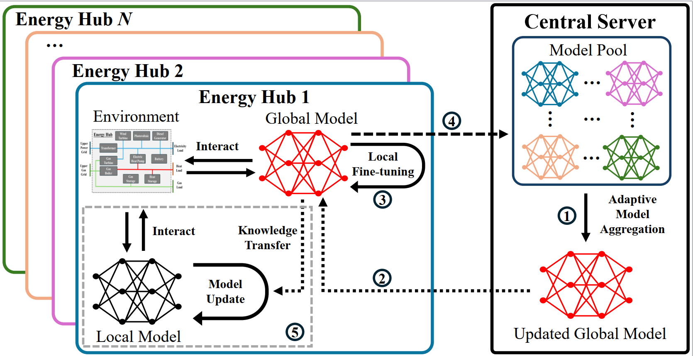

# Federated Heterogeneous-agent Reinforcement Learning

This repository is the official implementation for the paper: **"Federated Heterogeneous-agent Reinforcement Learning for the Flexible Dispatch of Energy Hubs"**.

Authors: Haoyuan Deng, Lingyu Chen, Wenbo Zeng, Xueyuan Cui, Yi Wang



## Overview

In this work, we introduce federated reinforcement learning (FRL) for flexible dispatch of energy hubs (EHs) and, specifically, propose a federated heterogeneous-agent reinforcement learning (FHRL) framework to overcome the challenges posed by inter-agent heterogeneity, which could lead to training instability and performance degradation in FRL. Our framework features an adaptive model aggregation method that extracts generalized knowledge of dispatch policies to generate the global model. Furthermore, it incorporates a knowledge transfer mechanism that leverages the generalized knowledge to guide the optimization of each local policy.

## Key Features

- **Heterogeneous Agents**: Support for agents with different preferences and configurations
- **Federated Learning**: Decentralized training with model aggregation
- **Knowledge Distillation**: Transfer learning between master and agent models
- **Safety-aware Algorithm**: Safety-aware reinforcement learning algorithm implementation

## Installation

### Prerequisites

- Python 3.9.21
- PyTorch
- NumPy
- Gym
- Matplotlib
- tqdm

## Usage

### Training

Run the main training script:

```bash
python main.py
```

The script contains:
- `global_model_training`: Trains the federated model using Simulator1
- `know_transfer`: Performs knowledge transfer using Simulator2 with knowledge distillation

### Configuration

Modify the `variant` dictionary in `main.py` to configure:
- Number of agents (`num_agent`)
- Training details (e.g., `train_iter`, `prate`)
- Agent preferences and configurations
- Output directories
- Random seeds

## Key Components

### Simulators
- **Simulator1** (`simulator_proposed2.py`): Federated global model training simulator
- **Simulator2** (`simulator_proposed2_KD.py`): Knowledge distillation simulator for enhancing local models

### Algorithms
- **Agent**: Safety-aware RL algorithm for continuous action spaces
- **Model Filtering**: Techniques for aggregating model updates in a federated setting

### Environment
- **EH_Model**: Energy hub model simulating distributed energy resource management under uncertainties

## Output

The training generates various output files:
- Model checkpoints (`.pkl` files)
- Training logs (`.npy` arrays)

## License

This implementation is provided for research purposes. Please check the original paper for licensing information.
